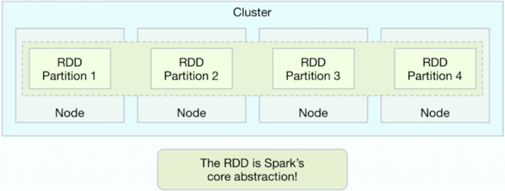

# SparkCourse

## **Hi Masha devs !**

Here Masha, with this repositorie about Spark

## Installation

## Information Course 

### What is an RDD?
RDD mean Resilient Distribution Dataset, also is the core abstraction of Spark, this is immutable at its core, assuring thread safety, **Odersky** has called it the "ultimate Scala collection"

